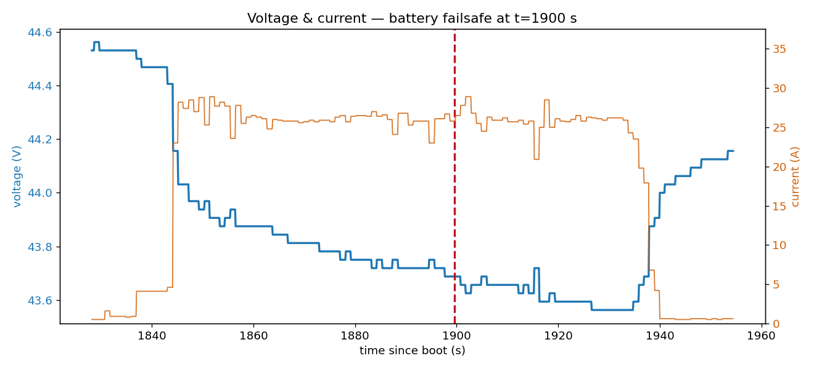
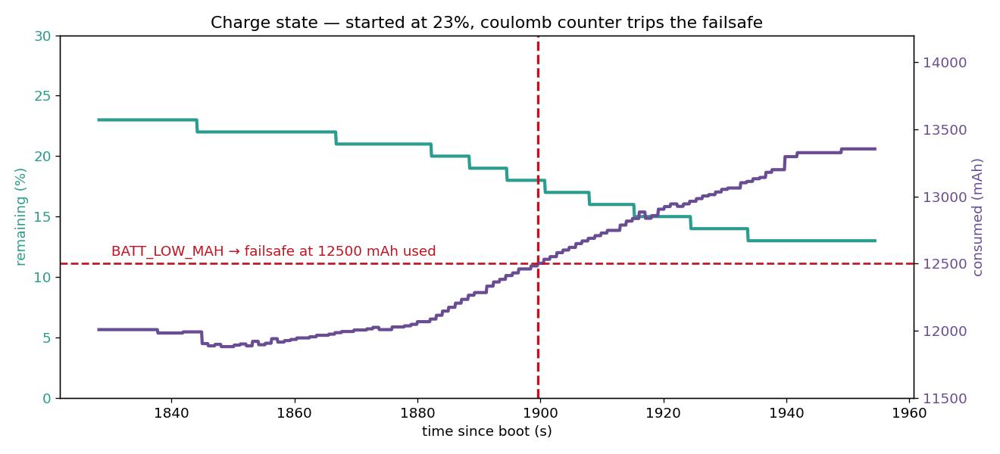
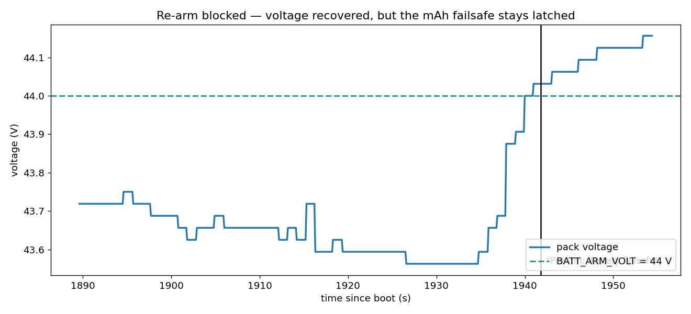

# Battery failsafe — worked diagnosis

The log: `2025-07-04 14-41-47.bin` (FUCHSIA). ArduCopter 4.3, hexacopter,
12S pack. This is the model for how deep your own two analyses should go
— a verdict you can defend, backed by specific values and timestamps,
honest about what the log cannot tell you.

Figures here are produced by `analyze.py`.

---

## The config that explains everything

From the log's `PARM` block (`bin2csv.py --keep-schema`, or a GCS param
dump):

| parameter | value | meaning |
|---|---|---|
| `BATT_CAPACITY` | 16000 mAh | configured pack size |
| `BATT_LOW_MAH` | 3500 | LOW failsafe when < 3500 mAh remain → **fires at 12,500 mAh used** |
| `BATT_CRT_MAH` | 2000 | CRITICAL at 14,000 mAh used |
| `BATT_LOW_VOLT` | **0** | **voltage failsafe disabled** |
| `BATT_LOW_TIMER` | 10 s | condition must hold this long |
| `BATT_FS_LOW_ACT` | 2 | LOW action = **RTL** |
| `BATT_ARM_VOLT` | 44.0 V | PreArm requires the pack ≥ 44.0 V |

## Timeline

| t (s) | event | record |
|---|---|---|
| 1828 | log starts — idle, 44.5 V, **12,008 mAh already used, RemPct 23 %** | `BAT` |
| ~1843 | takeoff | `EV` |
| **1899.6** | `"Battery 1 is low 43.69V used 12502 mAh"` → `Battery Failsafe` → RTL | `MSG`, `ERR` subsys 6, `MODE`→RTL |
| 1900.6 | `"Battery 2 is low 43.66V used 12526 mAh"` → `Battery Failsafe` | `MSG`, `ERR` subsys 6 |
| ~1939 | land, then disarm | `EV` |
| **1941.8** | `"PreArm: Battery failsafe"` — re-arm refused | `MSG` |
| 1954 | log ends — 44.13 V rested, 13,354 mAh used, RemPct 13 % | `BAT` |

---

## Q1 — Volt and Curr over the flight, failsafe marked

Idle at 44.5 V → takeoff, ~26 A, voltage settles 43.7–43.8 V → failsafe
at **t = 1899.6 s** (`ERR` subsystem 6 = battery failsafe) → RTL → lands,
and voltage rebounds to 44.1 V once the motors stop.

## Q2 — empty pack, or pulled down under load? Compare RemPct.

**Neither, dramatically — and the "low voltage" in the message is a red
herring.**

- **Under load:** the pack sags only ~0.4 V (43.7 V under 26 A at the
  trip, rests to 44.1 V). That is a healthy, low-resistance pack — it is
  not being dragged down.
- **Charge state:** `RemPct` **starts at 23 %** — this is the pack's
  second sortie. `CurrTot` opens at 12,008 mAh. About 6–7 minutes in,
  consumed crosses **12,500 mAh** and `BATT_LOW_MAH` fires. At landing
  the pack still had ~13 % — not dead.

So the trigger is the **coulomb counter reaching the configured 3,500
mAh reserve**, not voltage — `BATT_LOW_VOLT` is 0. The failsafe message
always prints both a voltage and a `used mAh`; the diagnosis is to check
`used mAh` against `BATT_LOW_MAH` and `BATT_CAPACITY`.

## Q3 — why was the next arm blocked?

- Voltage recovered to 44.1 V, **above** `BATT_ARM_VOLT` (44.0) — voltage
  is not the blocker.
- The failsafe is on **consumed capacity**, and consumed mAh only ever
  rises (13,354 at the end). Resting the pack restores voltage but not
  the coulomb count, so the failsafe stays latched and PreArm keeps
  refusing. It clears only when the monitor sees a fresh pack — a battery
  swap or power cycle.

Contrast worth remembering: a **voltage** failsafe self-clears once the
pack rebounds on the ground; a **capacity** failsafe does not.

---

## What this log cannot tell you

It records that the pack was flown down past its reserve, and that this
was its second sortie. It does **not** tell you *why* someone launched on
an already-75%-used pack — flight planning, a missed battery swap, a
misconfigured `BATT_CAPACITY`. That needs the operator, not the log.

## Carry into your own analysis

- When the log states it plainly (an explicit `ERR` / `MSG`), use that —
  don't infer what is already written down.
- Read voltage **under load**, not at rest. End-of-log 44.1 V looks
  fine; the same pack was at 43.6 V under load a minute earlier.
- "Low voltage" in a failsafe message is not the same as a voltage
  failsafe. Check which threshold actually tripped.
